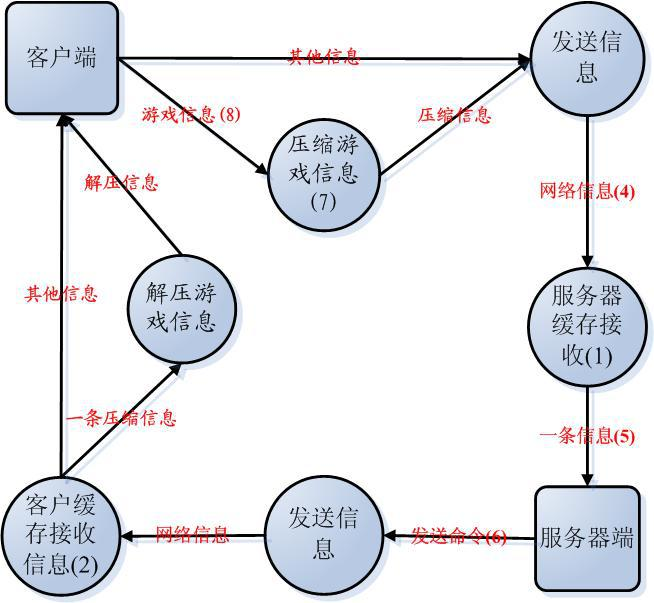

## QQ游戏 《火拼俄罗斯》
使用C#制作，仿照腾讯的QQ游戏，实现的6人游戏《火拼俄罗斯》。
个人兴趣爱好 模仿QQ游戏设计， 2006年设计。
## 游戏界面 
   游戏界面设计 
     
## 简介
     俄罗斯方块是一款风靡全球的电视游戏机和掌上游戏机游戏，它曾经造成的轰动与造成的经济价值可以说是游戏史上的一件大事。
     这款游戏最初是由苏联的游戏制作人Alex Pajitnov制作的，它看似简单但却变化无穷，令人上瘾。
     相信大多数用户都还记得为迷得茶不思饭不想的那个俄罗斯方块时代。 究其历史，俄罗斯方块最早还是出现在PC机上，
     而我国的用户都是通过红白机了解、喜欢上它的。现在联众又将重新掀起这股让人沉迷的俄罗斯方块风潮。
     对一般用户来说，它的规则简单，容易上手，且游戏过程变化无穷，而在"联众俄罗斯方块"中，
     更有一些联众网络游戏所独有的魅力――有单机作战与两人在线对战两种模式，用户可任选一种进行游戏。
     网络模式还增加了积分制，使用户既能感受到游戏中的乐趣，也给用户提供了一个展现自己高超技艺的场所。
    关键技术：C#双缓冲绘图，C#线称的同步与互斥以及线程池，C#类设计模式—工厂设计模式，C#网络编程，C#接口，
    C#类的继承，方法重载，Xml的读写，C#自定义控件，《数据结构》的矩阵、图、 队列、查找，回朔算法，Windows API函数,DirectX游戏编程。
## 主要技术点
  1,   设计模块 ( bridge , instance 等 )
  2，  双缓冲绘制 ( 防止界面闪烁 常用  )
  3，  数据结构 （ 矩阵转置 ）
  4，  消息的异步通知  （主要是网络消息的异步通知）
  5,  游戏界面信息的差异传输已经数据编码  
  6,  tcp 的网络编程   

##   项目架构及设计  
   整个系统由 游戏数据后台处理、网络—后台数据中间处理、 网络数据处理 三个部分组成。
    
    整体数据交互
    

##   数据流图
设计的总体思路还是挺简单的，  客户端总体分4大模块。如图下图: 
        1，图像界面模块 : 游戏的展示以及指令接收  。
        2，用户消息处理模块  : 负责接收用户指令，聊天等消息 。    
        3, 中间消息双向处理桥模块: 设计模式的 Bridge 模式, 接收网络命令 通知前端， 同时将前端用户指令发送到网络模块  。 
        4, 网络消息的接收与发送模块：  负责连接游戏服务器以及网络心跳维护。
    
    消息这里主要是 3类： 
        1，游戏指令和道具  :   主要是各种道具的使用了。    
        2，用户聊天消息    ：  玩家之间的聊天消息 。  
        3，游戏界面同步展示:   玩家直接的信息同步展示稍微麻烦一点， 为了减少网络传输量，
     主要采取两种办法： 1，只传输改变的界面信息，2，将界面方块信息编码成简单的整数传输。   
    
    消息缓冲处理， 主要需要考虑用户侧 和服务侧
    
    
##  方块类结构
每一个方块都是一个类 ， 每个方块都继承自 统一的父类( SuperBrick ) 
     1, 方块共同的父类 ( SuperBrick )  :   使用三维数组存储 2维数据旋转的 4个方向  
     2, 其他7种类型方块继承自 SuperBrick ： 
    
    
##  客户端类结构
1, Brige 类 ：  设计模式的桥模式, 负责调用 Tetirs_Bridge 接口 和 Message_Bridge 接口 
    2, 注册两个接口 :  Tetirs_Bridge 接口 和 Message_Bridge 接口
    

##  参考文献
参考文献：
1 Visual C#.NET编程精150例；		冶金工业出版社	
2 C#经典范例50讲；					清华大学出版社
3 数据结构——朱若愚               电子工业出版社
4 数据结构习题与解析——李春葆     清华大学出版社

## 最后
欢迎Star，提Issue和PR。
请遵循 [The Star And Thank Author License](https://github.com/zTrix/sata-license)  ～☆  
    
